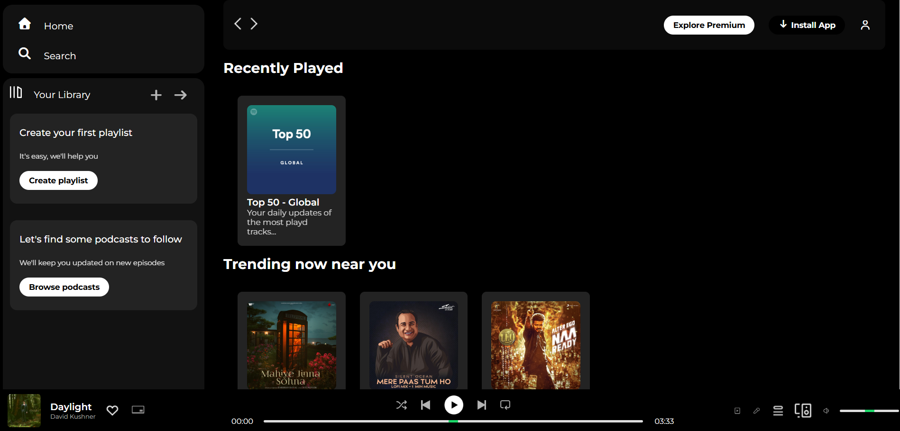

# 🎵 Spotify Clone
A responsive front-end clone of the Spotify web player built using **HTML** and **CSS**. This project replicates the core design and layout of Spotify, focusing on a clean user interface and a better understanding of front-end concepts.

## 🚀 Features
- 🎨 **Modern & Responsive Design** – Works across devices (desktop & mobile).  
- 📂 **Organized UI Components** – Navbar, playlists, and footer sections.  
- 🖼️ **Asset Management** – Properly structured `assets` and `homework_assets` directories for images and icons.  
- ⚡ **Lightweight** – Static site for fast performance.

## 🖼️ Project Preview

## 🎥 Demo Video
You can watch the demo video here:  
[▶ **Watch Demo**](./assests/demo.mp4)

## 🌐 Live Demo
**Hosted on GitHub Pages:**
👉 Click here to view the project: https://swastika708.github.io/Spotify_clone/ 

## 🛠️ Tech Stack
- **HTML5**
- **CSS3 (Flexbox & Grid)**
